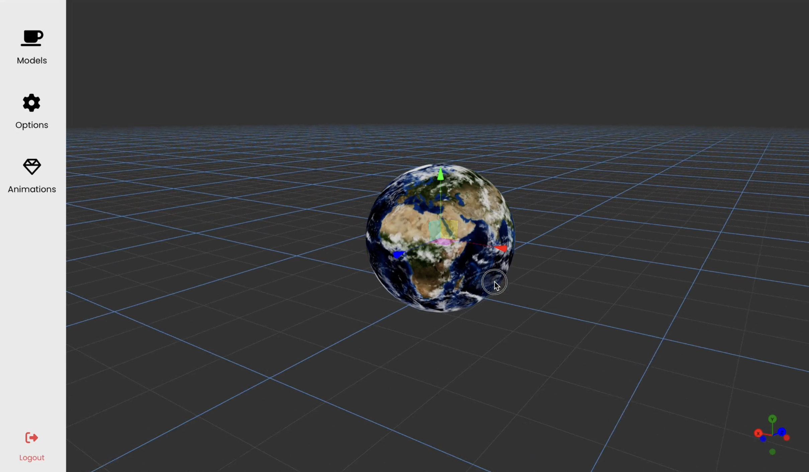

# SpaceXR

SpaceXR is a real-time collaborative 3D scene and animation creation app, based on CRDT (Conflict-free Replicated Data Type) principles. Developed as a minor project for the Computer Engineering course at Pulchowk Campus, this application is designed to be easy to use and facilitate seamless collaboration.

This project was developed by a team including myself and Anubhav Khanal ([@Username-AnubhavKhanal](https://github.com/Username-AnubhavKhanal)).



## Features

- Real-time collaboration
- Easy-to-use interface
- XR Support (ability to use in VR/AR)
- 3D scene creation
- Animation creation and player
- CRDT-based for conflict-free data replication

## Installation

To install and run SpaceXR locally, follow these steps:

1. Clone the repository:
    ```bash
    git clone https://github.com/pramishp/space-fe.git
    ```
2. Navigate to the project directory:
    ```bash
    cd space-fe
    ```
3. Install the required dependencies:
    ```bash
    npm install
    ```
4. Start the development server:
    ```bash
    npm start
    ```

## Usage

1. Open your browser and navigate to `http://localhost:3000`.
2. Create or join a 3D scene.
3. Start collaborating in real-time with other users.

## Demo Videos

Here are some demo videos showcasing the features and capabilities of SpaceXR:

### How it Works - Overview

[How it Works - Part 1](assets/how-it-works-1.mp4)

[How it Works - Part 2](assets/how-it-works-2.mp4)

[How it Works - Part 3](assets/how-it-works-3.mp4)

### Real-time Collaboration

[Real-time Collaboration](assets/multi%20user%20scene%20compositino.mp4)

### 3D Scene and Animation Creation

[3D Scene Creation](assets/drag-drop-animate.mp4)

[Animation Creation](assets/xr.mp4)

### Mobile XR and VR Interaction

[Mobile XR Interaction](assets/mobile%20xr%20animation%20play.MOV)

[VR Interaction](assets/vr%20interaction.mp4)

## Contributing

We welcome contributions to SpaceXR. To contribute, please follow these steps:

1. Fork the repository.
2. Create a new branch:
    ```bash
    git checkout -b feature-branch
    ```
3. Make your changes and commit them:
    ```bash
    git commit -m "Add new feature"
    ```
4. Push to the branch:
    ```bash
    git push origin feature-branch
    ```
5. Create a pull request describing your changes.

## Contact

For any questions or suggestions, feel free to reach out to us:

- [Pramish Paudel](https://github.com/pramishp)
- [Anubhav Khanal](https://github.com/Username-AnubhavKhanal)

## Useful Commands

1. `adb devices`  
2. `adb reverse tcp:3000 tcp:3000`  
3. `HOST=localhost PORT=1234 npx y-websocket`  
4. `HOST=localhost PORT=1234 YPERSISTENCE=./storage npx y-websocket`  
