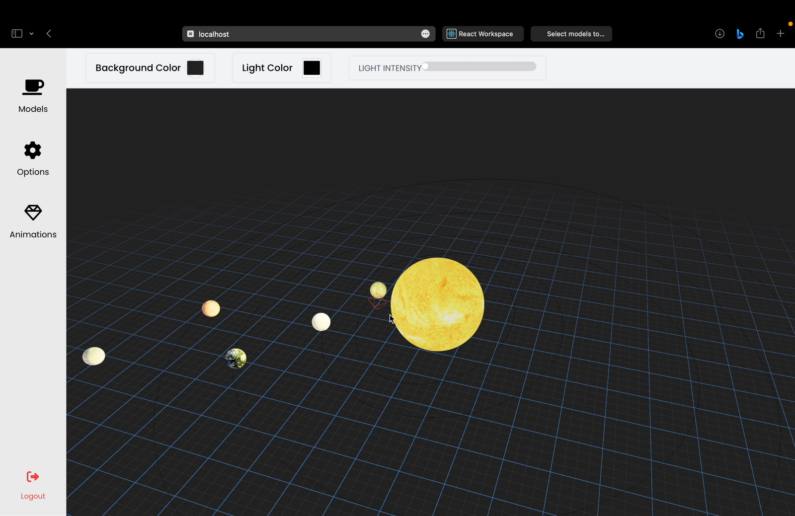

# SpaceXR

SpaceXR is a real-time collaborative 3D scene and animation creation app, based on CRDT (Conflict-free Replicated Data Type) principles. Developed as a minor project for the Computer Engineering course at Pulchowk Campus, this application is designed to be easy to use and facilitate seamless collaboration. 

This project was developed by a team including myself and Anubhav Khanal ([@Username-AnubhavKhanal](https://github.com/Username-AnubhavKhanal)).

[//]: # ()

## Features

- Real-time collaboration
- Easy-to-use interface
- XR Support (ability to use in VR/AR)
- 3D scene creation
- Animation creation and player
- CRDT-based for conflict-free data replication

## Installation

To install and run SpaceXR locally, follow these steps:

1. Clone the repository:
    ```bash
    git clone https://github.com/pramishp/space-fe.git
    ```
2. Navigate to the project directory:
    ```bash
    cd spacexr
    ```
3. Install the required dependencies:
    ```bash
    npm install
    ```
4. Start the development server:
    ```bash
    npm start
    ```

## Usage

1. Open your browser and navigate to `http://localhost:3000`.
2. Create or join a 3D scene.
3. Start collaborating in real-time with other users.

## Demo Videos

Here are some demo videos showcasing the features and capabilities of SpaceXR:

### How it Works - Overview
<video width="320" height="240" autoplay loop>
  <source src="assets/how-it-works-1.mp4" type="video/mp4">
  Your browser does not support the video tag.
</video>
<video width="320" height="240" autoplay loop>
  <source src="assets/how-it-works-2.mp4" type="video/mp4">
  Your browser does not support the video tag.
</video>
<video width="320" height="240" autoplay loop>
  <source src="assets/how-it-works-3.mp4" type="video/mp4">
  Your browser does not support the video tag.
</video>
### Real-time Collaboration
<video width="320" height="240" autoplay loop>
  <source src="assets/multi%20user%20scene%20compositino.mp4" type="video/mp4">
  Your browser does not support the video tag.
</video>
### 3D Scene and Animation Creation
<video width="320" height="240" autoplay loop>
  <source src="assets/multi%20user%20scene%20compositino.mp4" type="video/mp4">
  Your browser does not support the video tag.
</video>
<video width="320" height="240" autoplay loop>
  <source src="assets/xr.mp4" type="video/mp4">
  Your browser does not support the video tag.
</video>

[//]: # (### Final Animation)

[//]: # (<video width="320" height="240" autoplay loop>)

[//]: # (  <source src="final animation.mov" type="video/mp4">)

[//]: # (  Your browser does not support the video tag.)

[//]: # (</video>)
### Mobile XR and VR Interaction
<video width="320" height="240" autoplay loop>
  <source src="assets/mobile%20xr%20animation%20play.MOV" type="video/mp4">
  Your browser does not support the video tag.
</video>
<video width="320" height="240" autoplay loop>
  <source src="assets/vr%20interaction.mp4" type="video/mp4">
  Your browser does not support the video tag.
</video>

## Contributing

We welcome contributions to SpaceXR. To contribute, please follow these steps:

1. Fork the repository.
2. Create a new branch:
    ```bash
    git checkout -b feature-branch
    ```
3. Make your changes and commit them:
    ```bash
    git commit -m "Add new feature"
    ```
4. Push to the branch:
    ```bash
    git push origin feature-branch
    ```
5. Create a pull request describing your changes.

[//]: # (## License)

[//]: # ()
[//]: # (This project is licensed under the MIT License. See the [LICENSE]&#40;LICENSE&#41; file for details.)

## Contact

For any questions or suggestions, feel free to reach out to us:

- [Pramish Paudel](https://github.com/pramishp)
- [Anubhav Khanal](https://github.com/Username-AnubhavKhanal)

##Useful commands

1. `adb devices`<br>
2. `adb reverse tcp:3000 tcp:3000`<br>
3. `HOST=localhost PORT=1234 npx y-websocket`<br>
4. `HOST=localhost PORT=1234 YPERSISTENCE=./storage npx y-websocket`<br>
